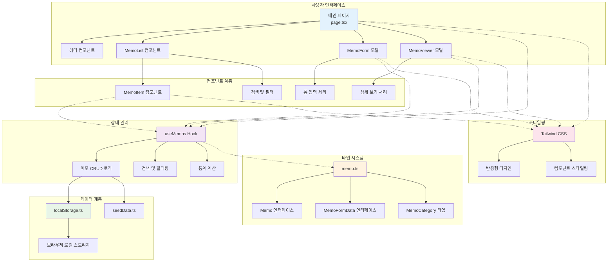

# 메모 앱 시스템 아키텍처

## 개요

이 다이어그램은 메모 앱의 전체 시스템 아키텍처를 보여줍니다. Next.js 기반의 프론트엔드 애플리케이션으로, 로컬 스토리지를 활용한 데이터 관리와 컴포넌트 기반의 모듈화된 구조를 가지고 있습니다.

## 다이어그램

## 설명

### 사용자 인터페이스 레이어
- **메인 페이지**: 애플리케이션의 진입점으로 모든 컴포넌트를 조합
- **헤더 컴포넌트**: 앱 제목과 새 메모 생성 버튼
- **MemoList 컴포넌트**: 메모 목록 표시 및 검색/필터 기능
- **MemoForm 모달**: 메모 생성 및 편집을 위한 모달 폼
- **MemoViewer 모달**: 메모 상세 보기를 위한 모달 뷰어

### 컴포넌트 계층
- **MemoItem 컴포넌트**: 개별 메모 카드 표시
- **검색 및 필터**: 제목/내용 검색 및 카테고리 필터링
- **폼 입력 처리**: 메모 데이터 입력 및 유효성 검사
- **상세 보기 처리**: 메모 전체 내용 표시 및 액션 버튼

### 상태 관리
- **useMemos Hook**: 메모 데이터의 CRUD 작업 관리
- **메모 CRUD 로직**: 생성, 읽기, 수정, 삭제 기능
- **검색 및 필터링**: 실시간 검색과 카테고리별 필터링
- **통계 계산**: 전체 메모 수, 필터된 메모 수, 카테고리별 통계

### 데이터 계층
- **localStorage.ts**: 브라우저 로컬 스토리지와의 상호작용
- **브라우저 로컬 스토리지**: 클라이언트 사이드 데이터 저장
- **seedData.ts**: 초기 샘플 데이터 제공

### 타입 시스템
- **Memo 인터페이스**: 메모 객체의 구조 정의
- **MemoFormData 인터페이스**: 폼 입력 데이터 구조
- **MemoCategory 타입**: 메모 카테고리 열거형

### 스타일링
- **Tailwind CSS**: 유틸리티 기반 CSS 프레임워크
- **반응형 디자인**: 모바일, 태블릿, 데스크톱 대응
- **컴포넌트 스타일링**: 일관된 디자인 시스템 적용

## 참고사항

- 모든 데이터는 브라우저 로컬 스토리지에 저장되어 페이지 새로고침 시에도 유지됩니다
- 컴포넌트 간 통신은 props와 콜백 함수를 통해 이루어집니다
- 상태 관리는 React의 useState와 useEffect를 활용합니다
- 타입 안전성을 위해 TypeScript를 사용합니다 